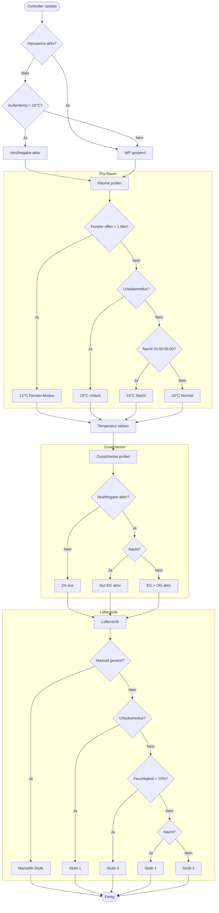

# Schwörer WGT Controller

[](https://github.com/custom-components/hacs)

Eine Home Assistant Custom Integration zur intelligenten Steuerung der Schwörer WGT/WRT Wohnraumlüftung.

Diese Integration fungiert als "Controller" für die [schwoerer_lueftung](https://github.com/josa42/homeassistant-schwoerer-lueftung) Integration und automatisiert die Heizungs- und Lüftungssteuerung basierend auf:

- 🌙 **Nachtabsenkung** - Temperatur reduzieren nachts
- 🏖️ **Urlaubsmodus** - Energie sparen bei Abwesenheit
- 🪟 **Fenster-Erkennung** - Heizung drosseln bei offenen Fenstern
- 🌡️ **Außentemperatur** - Wärmepumpe nur bei Bedarf freigeben
- 💨 **Lüfterstufen** - Automatik basierend auf Luftfeuchtigkeit und Tageszeit

## Entscheidungslogik



## Installation

### HACS (empfohlen)

1. HACS öffnen
2. Auf die drei Punkte oben rechts klicken → "Benutzerdefinierte Repositories"
3. Repository-URL eingeben: `https://github.com/josa42/homeassistant-schwoerer-wgt-controller`
4. Kategorie: "Integration"
5. "Hinzufügen" klicken
6. Integration suchen und installieren
7. Home Assistant neu starten

### Manuell

1. Repository herunterladen
2. `custom_components/schwoerer_wgt_controller` in deinen `custom_components` Ordner kopieren
3. Home Assistant neu starten

## Konfiguration

### Voraussetzungen

- Die [schwoerer_lueftung](https://github.com/josa42/homeassistant-schwoerer-lueftung) Integration muss installiert und konfiguriert sein
- Fenstersensoren (z.B. Zigbee) für die Fenster-Erkennung
- Optional: `input_boolean` Helfer für Urlaubsmodus und Heizsperre

### Setup

1. Einstellungen → Geräte & Dienste → Integration hinzufügen
2. "Schwörer WGT Controller" suchen
3. Die Integration erkennt automatisch die Räume aus `schwoerer_lueftung`
4. Externe Entities konfigurieren:
   - Urlaubsmodus Entity (`input_boolean.vacation_mode`)
   - Heizsperre Entity (`input_boolean.heizung_sperren`)
   - Luftfeuchtigkeitssensor (`sensor.badezimmer_luftsensor_luftfeuchtigkeit`)
   - Lüfterstufen-Override (`input_select.heizung_lufterstufe`)

### Nachträgliche Konfiguration

Alle Einstellungen können über den "Konfigurieren" Button in der Integration geändert werden:

- **Temperaturen**: Normal, Nacht, Urlaub, Fenster-offen (global und pro Raum)
- **Zeiteinstellungen**: Nachtmodus Start/Ende, Fenster-Verzögerung
- **Lüfterstufen**: Normal, Nacht, Urlaub, Hohe Luftfeuchtigkeit
- **Schwellwerte**: Außentemperatur für Heizfreigabe, Luftfeuchtigkeit
- **Räume**: Fenstersensor-Zuordnung, Etage (EG/OG), individuelle Temperaturen

## Entities

### Sensoren

| Entity | Beschreibung |
|--------|--------------|
| `sensor.controller_status` | Aktueller Status (Normal/Nacht/Urlaub/Gesperrt) |
| `sensor.controller_explanation` | Textuelle Erklärung des aktuellen Zustands |
| `sensor.{raum}_mode` | Modus pro Raum |
| `sensor.{raum}_solltemperatur` | Berechnete Solltemperatur pro Raum |
| `sensor.{raum}_begrundung` | Erklärung warum diese Temperatur gesetzt ist |

### Binary Sensoren

| Entity | Beschreibung |
|--------|--------------|
| `binary_sensor.heating_release` | Heizfreigabe aktiv |
| `binary_sensor.cooling_release` | Kühlfreigabe aktiv |
| `binary_sensor.night_mode` | Nachtmodus aktiv |
| `binary_sensor.vacation_mode` | Urlaubsmodus aktiv |

### Switches

| Entity | Beschreibung |
|--------|--------------|
| `switch.controller_enabled` | Controller ein/aus |
| `switch.test_mode` | Testmodus (nur Logging, keine Aktionen) |

## Testmodus

Im Testmodus werden alle Aktionen nur geloggt, aber nicht ausgeführt. So kannst du die Logik überprüfen, ohne Änderungen an deiner Anlage vorzunehmen.

Aktivieren:
- Über den Switch `switch.test_mode`
- Oder beim Setup im Config Flow

Die Logs zeigen dann:
```
[TEST MODE] Would execute: set_room_temperature on climate.wgt_wohnzimmer = 19.0 (Reason: Nachtmodus → 19°C)
```

## Beispiel: Erklärungssensor

Der Erklärungssensor zeigt immer, warum der aktuelle Zustand so ist:

- "Nachtabsenkung aktiv (20:00-05:00) → 19°C"
- "Fenster offen seit 3 Min → 12°C"
- "Urlaubsmodus aktiv → 18°C"
- "Außentemperatur 8°C < 16°C → Heizfreigabe"

## Default-Werte

| Einstellung | Default |
|-------------|---------|
| Normal-Temperatur | 20°C |
| Nacht-Temperatur | 19°C |
| Urlaubs-Temperatur | 18°C |
| Fenster-offen-Temperatur | 12°C |
| Nachtmodus | 20:00 - 05:00 |
| Lüfterstufe Normal | 2 |
| Lüfterstufe Nacht/Urlaub | 1 |
| Lüfterstufe hohe Feuchtigkeit | 3 |
| Außentemperatur-Schwelle | 16°C |
| Luftfeuchtigkeits-Schwelle | 70% |
| Fenster-Verzögerung | 1 Min |

## Lizenz

MIT
