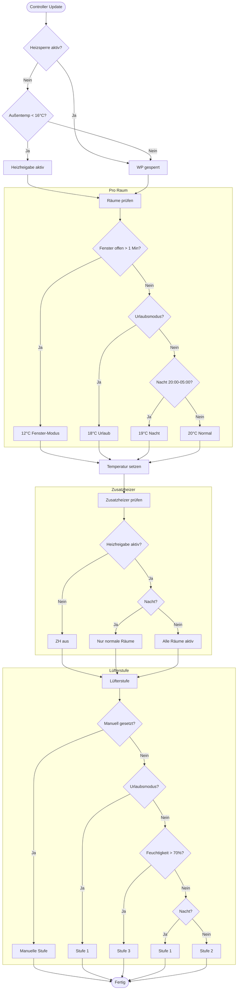

# Entscheidungslogik

Dieser Flowchart zeigt die vollständige Entscheidungslogik des Controllers bei jedem Update-Zyklus.

## Ablauf-Diagramm

## Regel-Prioritäten

Die Regeln werden in folgender Priorität ausgewertet:

| Priorität | Regel | Beschreibung |
|-----------|-------|--------------|
| 100 | Heizsperre | Manuelle Sperrung überschreibt alles |
| 100 | Lüfterstufen-Override | Manuell gesetzte Lüfterstufe |
| 50 | Heizfreigabe | Basierend auf Außentemperatur |
| 30 | Lüfterstufen-Automatik | Urlaub > Feuchtigkeit > Nacht > Normal |
| 20 | Zusatzheizer | Nur bei aktiver Heizfreigabe |
| 10 | Raumtemperatur | Fenster > Urlaub > Nacht > Normal |

## Regelbeschreibungen

### Heizsperre-Regel (Priorität 100)
- Blockiert die Wärmepumpen-Freigabe komplett
- Aktiviert via `switch.wgt_controller_heizsperre`
- Überschreibt alle anderen Regeln

### Heizfreigabe-Regel (Priorität 50)
- Prüft Außentemperatur gegen Schwellwert (Standard: 16°C)
- Gibt Heizen frei wenn `Außentemp < Schwellwert`
- Gibt Kühlen frei wenn `Außentemp > Schwellwert`

### Raumtemperatur-Regel (Priorität 10)
Pro Raum, in dieser Reihenfolge:
1. **Fenster offen**: 12°C (wenn > 1 Min offen)
2. **Urlaubsmodus**: 18°C
3. **Nachtmodus**: 19°C (20:00-05:00)
4. **Normal**: 20°C

### Zusatzheizer-Regel (Priorität 20)
- Nur aktiv wenn Heizfreigabe aktiv ist
- **Schlafräume**: Nachts deaktiviert (Energie sparen)
- **Normale Räume**: Immer aktiv (bei Heizfreigabe)

### Lüfterstufen-Regel (Priorität 30/100)
- **Override** (Priorität 100): Manuell via `select.wgt_controller_lufterstufen_override`
- **Automatik** (Priorität 30):
  1. Urlaubsmodus: Stufe 1
  2. Hohe Feuchtigkeit (>70%): Stufe 3
  3. Nachtmodus: Stufe 1
  4. Normal: Stufe 2
